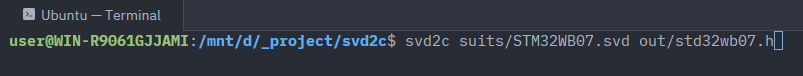
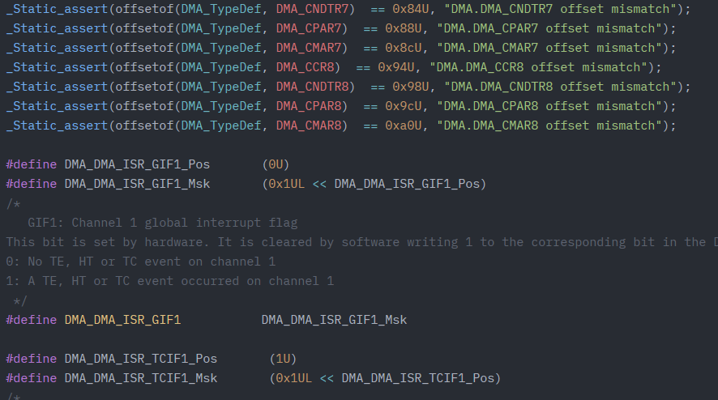

# svd2c

### Transform .svd files into C-headers in one line





## Installation

Install globally...
```bash
npm i -g svd2c
```

...or use `npx`
```bash
npx svd2c 
```

## Usage

- Simply pass input svd file and get your .h file with the same name
```bash
svd2c stm32f103.svd
```
- Pass input svd file and some output path
```bash
svd2c stm32f103.svd headers/stm32f103.h
```

## Where do I get any .svd?
For stm32 devices: shout out to the https://github.com/modm-io/cmsis-svd-stm32
